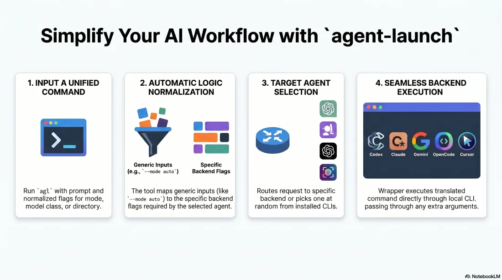

# agent-launch



One command for launching the local coding-agent CLIs installed on this machine:

- Antigravity CLI (`agy`)
- Aider (`aider`)
- Amp (`amp`)
- Codex CLI (`codex`)
- Claude Code (`claude`)
- Cline (`cline`)
- Factory Droid (`droid`)
- Gemini CLI (`gemini`)
- Grok Build (`grok`)
- Kilo Code (`kilo`)
- Kimi Code (`kimi`)
- Kiro CLI (`kiro-cli`, exposed as `--agent kiro`)
- OpenCode (`opencode`)
- Pi Coding Agent (`pi`)
- Qwen Code (`qwen`)
- Cursor Agent (`agent`, exposed as `--agent cursor`)
- Random selection across installed agent CLIs (`--agent random`), avoiding the same backend on consecutive runs when another installed option exists

It normalizes the common controls that usually differ across these tools:

- interactive vs non-interactive execution
- initial prompt
- working directory
- permission/interaction mode
- model class (`fast` or `pro`)
- session resume
- latest-session continue
- non-interactive agent failover order

By default, `agent-launch` starts agents in `auto` mode unless `AGENT_LAUNCH_MODE` or `--mode` overrides it.

## Demo

<video src="https://raw.githubusercontent.com/dhruv-anand-aintech/agent-launch/main/docs/assets/agent-launch-demo.mp4" controls width="720" poster="docs/assets/agent-launch-demo-thumb.jpg"></video>

[Watch the demo video](https://raw.githubusercontent.com/dhruv-anand-aintech/agent-launch/main/docs/assets/agent-launch-demo.mp4)

## Install

Primary install path:

```sh
npm install -g github:dhruv-anand-aintech/agent-launch
```

This installs the `agent-launch` command (with `agl` as a short alias) through npm's global bin directory. If your shell cannot find them, check `npm bin -g` and ensure that directory is on `PATH`.

Update later with:

```sh
npm install -g github:dhruv-anand-aintech/agent-launch
```

Manual/local checkout install:

```sh
./install.sh
```

This installs `bin/agent-launch` to `~/.local/bin/agent-launch` and symlinks `~/.local/bin/agl` to it as a short alias.
It also installs zsh completions to `~/.zfunc/_agent-launch` (bound to both `agent-launch` and `agl`).
If Oh My Zsh is present, it also installs an explicit binding snippet to:

```text
~/.oh-my-zsh/custom/agent-launch.zsh
```

If `agent-launch` is not found after install, add this to your shell startup file:

```sh
export PATH="$HOME/.local/bin:$PATH"
```

## Usage

`agl` is a short alias for `agent-launch` and is installed alongside it — the two are interchangeable:

```sh
agl -a claude -i -C ~/Code/my-repo 'inspect this repo'
```

```sh
agent-launch --agent codex --non-interactive --mode danger -C ~/Code/my-repo --prompt 'run tests and fix failures'
agent-launch --agent claude --interactive --mode plan -C ~/Code/my-repo 'inspect this repo'
agent-launch --agent cursor --non-interactive --model-class fast -C ~/Code/my-repo --prompt 'summarize the codebase'
agent-launch --agent antigravity --dry-run --mode danger -C ~/Code/my-repo --prompt 'implement the task'
agent-launch --agent gemini --dry-run --mode auto --model-class pro -C ~/Code/my-repo --prompt 'implement the task'
agent-launch --agent random --interactive -C ~/Code/my-repo --prompt 'inspect this repo'
agent-launch --non-interactive --agent-order codex,claude,cursor -C ~/Code/my-repo --prompt 'implement the task'
agent-launch --non-interactive --prefer claude,codex -C ~/Code/my-repo --prompt 'implement the task'
```

Short flags:

```sh
agent-launch -a codex -n -m danger -C ~/Code/my-repo -p 'run tests'
agent-launch -a claude -i -m plan -C ~/Code/my-repo 'review this change'
```

## Options

| Option | Meaning |
| --- | --- |
| `--agent` / `-a` | Any built-in agent key, including `aider`, `amp`, `antigravity`, `claude`, `cline`, `codex`, `cursor`, `droid`, `gemini`, `grok`, `kilo`, `kimi`, `kiro`, `opencode`, `pi`, `qwen`, or `random`; defaults to `random` |
| `--agent-order` | Non-interactive failover order. Pass comma-separated agents, use without a value for the built-in default, or set `AGENT_LAUNCH_AGENT_ORDER` |
| `--prefer` | Non-interactive preferred agents. Moves the comma-separated agents to the front of the default failover order, or set `AGENT_LAUNCH_PREFER` |
| `--interactive` / `-i` | Start an interactive TUI/session |
| `--non-interactive` / `-n` | Run headlessly and print the result |
| `--prompt` / `-p` | Initial prompt |
| `--prompt-file` | Read the initial prompt from a UTF-8 text file |
| positional text | Prompt text when `--prompt` is omitted |
| `--cwd` / `-C` | Workspace/working directory |
| `--mode` / `-m` | `default`, `ask`, `plan`, `auto`, or `danger`; defaults to `AGENT_LAUNCH_MODE` or `danger` |
| `--model-class` | `fast` or `pro` |
| `--model` | Explicit backend model string; overrides `--model-class` |
| `--no-model` | Do not pass a model flag |
| `--resume [id]` | Resume a previous session |
| `--continue` | Continue the latest/current session |
| `--dry-run` | Print translated backend command without running it |
| `--attempt-timeout` | Timeout in seconds for each non-interactive backend attempt; returns exit code `124` on timeout |
| `--extra` | Append raw backend arguments; repeat as needed |
| `--` | Pass all following arguments through to the selected backend CLI |
| `--print-mappings` | Show built-in agent/model mappings |

## Backend Argument Pass-Through

Arguments after `--` are passed directly to the selected backend CLI. This is useful for backend-specific flags that `agent-launch` does not normalize.

```sh
agent-launch -a claude -n -p 'summarize' -- --output-format json --max-budget-usd 1
agent-launch -a codex -n -p 'review' -- --json
agent-launch -a opencode -n -p 'work' -- --format json --title scratch
```

Unknown wrapper arguments before `--` are also forwarded when they can be parsed safely, but `--` is the reliable form for flags with values.

## Non-Interactive Failover

For unattended runs, `--agent-order` retries the same prompt with each backend until one exits with status `0`. Any non-zero exit code moves to the next agent in the order, which is useful when an account is temporarily out of usage.

```sh
agent-launch -n --agent-order codex,claude,cursor -C ~/Code/my-repo -p 'run tests and fix failures'
agent-launch -n --agent-order -C ~/Code/my-repo -p 'summarize this repo'
agent-launch -n --prefer codex --prompt-file /tmp/prompt.txt -C ~/Code/my-repo
agent-launch -n --prefer cursor,claude -C ~/Code/my-repo -p 'run with cursor,claude before the default remainder'
AGENT_LAUNCH_AGENT_ORDER=claude,codex,cursor agent-launch -n -C ~/Code/my-repo -p 'implement the task'
AGENT_LAUNCH_PREFER=claude,codex agent-launch -n -C ~/Code/my-repo -p 'implement the task'
```

`--agent-order` and `--prefer` are intentionally non-interactive only. The built-in default order is `codex, claude, cursor, opencode, antigravity, gemini, aider, amp, cline, droid, grok, kilo, kimi, kiro, pi, qwen`. With that default, `--prefer cursor,claude` runs `cursor, claude, codex, opencode, antigravity, gemini, aider, amp, cline, droid, grok, kilo, kimi, kiro, pi, qwen`.

## Feature Matrix

The coding-agent/CLI/IDE feature matrix lives in [`docs/tools/agent_matrix`](docs/tools/agent_matrix/README.md). It stores one JSON file per agent surface, plus a schema and generated bundle, following the same data-first pattern as Superlinked's VectorHub comparison table.

## Shell Completion

The installer adds zsh completion support. After installing, a new shell should complete:

```sh
agent-launch -<TAB>
agent-launch -a <TAB>
agent-launch --mode <TAB>
agent-launch --model-class <TAB>
```

Completion is intentionally scoped to `agent-launch` itself. It does not shell out to Antigravity, Codex, Claude, Gemini, OpenCode, or Cursor to discover their full native option sets. Backend-specific flags should be passed after `--`.

For zsh users, completions work when the installed completion directory is in `fpath` before `compinit` runs. The installer writes:

```text
~/.zfunc/_agent-launch
```

Add this to `~/.zshrc` if your shell does not already load `~/.zfunc`:

```sh
fpath=("$HOME/.zfunc" $fpath)
autoload -Uz compinit
compinit
```

If you use Oh My Zsh, put the `fpath=...` line before `source "$ZSH/oh-my-zsh.sh"` when possible, or before any existing `compinit` call.

If your `fpath` is configured after Oh My Zsh is loaded, add an explicit binding after that `fpath` line:

```sh
autoload -Uz _agent-launch 2>/dev/null
(( $+functions[compdef] )) && compdef _agent-launch agent-launch
```

If completions do not appear in an already-open shell, reload completion state:

```sh
autoload -Uz compinit && compinit
```

If zsh has cached an older completion definition, rebuild the completion dump:

```sh
rm -f ~/.zcompdump*
autoload -Uz compinit && compinit
```


## Mode Mapping

`agent-launch` exposes five normalized modes.

| Normalized mode | Intent |
| --- | --- |
| `default` | Let the backend use its normal defaults |
| `ask` | Read-mostly Q&A/explanation mode when the backend supports it |
| `plan` | Planning/read-only mode where supported |
| `auto` | More autonomous editing/approval mode without fully disabling safety |
| `danger` | Maximum local autonomy; may bypass approvals/sandboxing |

Backend flag mapping:

| Agent | `ask` | `plan` | `auto` | `danger` |
| --- | --- | --- | --- | --- |
| Antigravity CLI | backend default | `--sandbox` | backend default | `--dangerously-skip-permissions` |
| Codex | `-s read-only` | `-s read-only` | backend default | `--dangerously-bypass-approvals-and-sandbox` |
| Claude Code | `--permission-mode default` | `--permission-mode plan` | `--permission-mode auto` | `--dangerously-skip-permissions` |
| Gemini CLI | `--approval-mode default` | `--approval-mode plan` | `--approval-mode auto_edit` | `--yolo` |
| OpenCode | `--agent ask` | `--agent plan` | backend default | `--dangerously-skip-permissions` in non-interactive mode |
| Cursor Agent | `--mode ask` | `--mode plan` | `--force` | `--yolo --sandbox disabled` |

Use `--dry-run` to inspect the exact command before running a mode:

```sh
agent-launch -a codex -n -m danger -C /tmp -p 'hello' --dry-run
```

## Model Mapping

The wrapper exposes only two model classes:

- `fast`: lower-latency/default-economy choice
- `pro`: stronger default choice

Built-in defaults:

| Agent | Fast | Pro | Default |
| --- | --- | --- | --- |
| Antigravity CLI | backend configured model | backend configured model | backend configured model |
| Codex | `gpt-5.4-mini` | `gpt-5.5` with low reasoning effort | `pro` |
| Claude Code | `sonnet` | `opus` | `pro` |
| Gemini CLI | `gemini-2.5-flash` | `gemini-2.5-pro` | `pro` |
| OpenCode | `opencode-go/deepseek-v4-flash` | `opencode-go/kimi-k2.6` | `pro` |
| Cursor Agent | `composer-2.5-fast` | `composer-2.5-fast` | `fast` |

Antigravity CLI does not expose a launch-time model flag in `agy --help`; set its default model interactively with `/model`, which persists across sessions.

`--agent random` chooses one concrete backend uniformly at runtime from the installed subset of `antigravity`, `claude`, `codex`, `cursor`, and `opencode` (each backend's CLI must be on `PATH`), then uses that backend's normal fast/pro mapping where supported. Consecutive random launches never repeat the immediately previous pick when another installed option exists (state is stored under `$XDG_STATE_HOME/agent-launch/last-random-agent`, defaulting to `~/.local/state`). Gemini CLI remains available explicitly via `--agent gemini`, but is not in the random pool.

You can override these without editing the script:

```sh
export AGENT_LAUNCH_MODEL_CLASS=fast
export AGENT_LAUNCH_CODEX_PRO_MODEL=gpt-5.4
export AGENT_LAUNCH_OPENCODE_FAST_MODEL=openai/gpt-5-mini
```

Environment override format:

```text
AGENT_LAUNCH_<AGENT>_<FAST_OR_PRO>_MODEL
```

Examples:

```sh
AGENT_LAUNCH_CURSOR_PRO_MODEL=gpt-5.5-medium agent-launch -a cursor -n -p 'work'
AGENT_LAUNCH_GEMINI_FAST_MODEL=gemini-2.5-flash-lite agent-launch -a gemini --model-class fast -p 'work'
```

Use `--model <backend-model>` for one-off overrides, or `--no-model` to let the backend choose.

## Focus Logger

A small bundled utility to diagnose which macOS application steals focus.

```sh
focus-logger
```

Logs every frontmost-application change with a timestamp:

```
Monitoring focus changes every 0.2s…
Press Ctrl+C to stop
[14:32:01.234] Terminal
[14:32:05.678] Cursor
[14:32:05.912] Finder
```

Common flags:

| Flag | Description |
| --- | --- |
| `-i 0.05` | Poll every 50 ms (default 200 ms) |
| `-o log.txt` | Also append to a file |
| `--show-duration` | Print how long the previous app held focus |
| `--csv` | Output `timestamp,app,duration_ms` for analysis |

`fl` is installed as a short alias for `focus-logger`.

## Resume Notes

The wrapper translates `--resume` to each backend's native resume flag.

For Codex, pass the actual UUID, not the full `rollout-...jsonl` filename stem:

```sh
agent-launch -a codex --resume 019e29c8-f222-7e70-9697-1219a6e0c06b
agent-launch -a claude --continue
```

## Safety

`--mode danger` intentionally maps to each backend's most permissive local mode where known. Use `--dry-run` first when you are unsure.

## License

MIT
